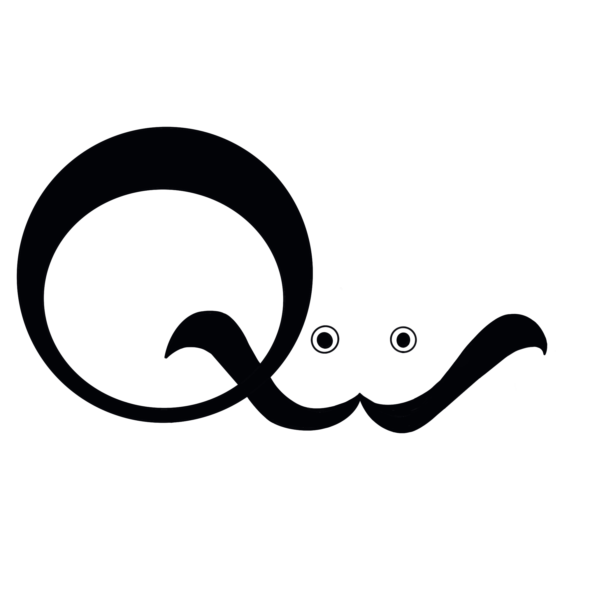

# qwgc

[](https://opensource.org/licenses/Apache-2.0)



qwgc stands for *Q*uantum *W*alk *G*raph *C*lassifier.
This project aims to classify graph data with high accuracy.
The key ideas of quantum machine learning and quantum walk are [here](https://qwqmlft.github.io/QuantumFrontier).
<!-- put the link to our web site -->

## How to install

First, clone remote repository to your local.

`git clone https://github.com/qwqmlf/qwgc.git`

and then,

```zsh
cd qwgc
pip install -e .
```

If you don't have any errors, your build is success.

## How to use

[experiments.toml](https://github.com/qwqmlf/qwgc/blob/master/qwgc/experiments.toml) is the configuration (Hyper parameter) for QWGC.

Put hyper parameters and then run

```zsh
cd qwgc
python QWGC.py
```

(This simulation may take a long time to finish)

## Tutorials

[Here](./notebook/tutorial.ipynb) is the tutorials how to use this (Japanese).

## Acknowledgement

This project is supported by IPA mitou target project.
